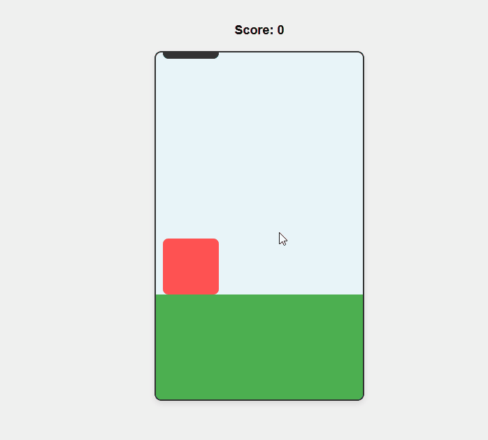

# 🎮 Dodge Game | Code #102  
**Source code for [YouTube tutorial](https://www.youtube.com/watch?v=j6KNr6AFapAE)**  
*A simple HTML5 canvas game with keyboard controls*  

  

## 🚀 Features  
- WASD/Arrow key controls  
- Collision detection  
- Score tracking  

## 🔥 Live Demo  
[▶️ Play Now](https://sidocodeyt.github.io/sidocode-demos/code-102-dodge-game/)  

## 📺 Tutorial  
[](https://www.youtube.com/watch?v=j6KNr6AFapA)  

## 🛠️ How to Use  
1. Clone the repo:  
   ```bash  
   git clone https://github.com/sidocodeyt/sidocode-demos.git  