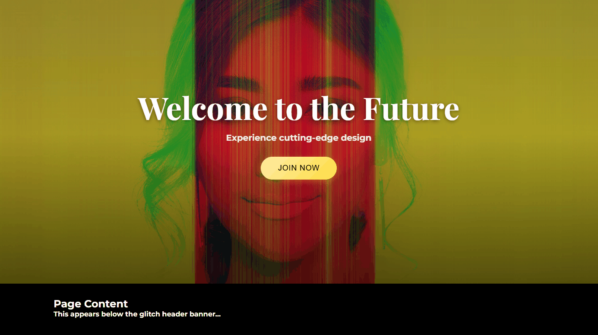

# Website Header Banner Glitch Image Effect with GSAP | Code #104 
**Source code for [YouTube tutorial](https://youtu.be/WZ6No5EMR9s)**  
*Ready to use Website header banner*

### Mobile 
 
### Desktop
 

## 🚀 Features  
- Easy to customise
- Mobile-responsive design 

## 🔥 Live Demo  
[▶️ Try it here](https://sidocodeyt.github.io/sidocode-demos/code-104-glitch-effect-website-banner/)  

## 📺 Tutorial  
[](https://www.youtube.com/watch?v=WZ6No5EMR9s)

## 🛠️ How to Use  
1. Clone the repo:  
   ```bash  
   git clone https://github.com/sidocodeyt/sidocode-demos.git  